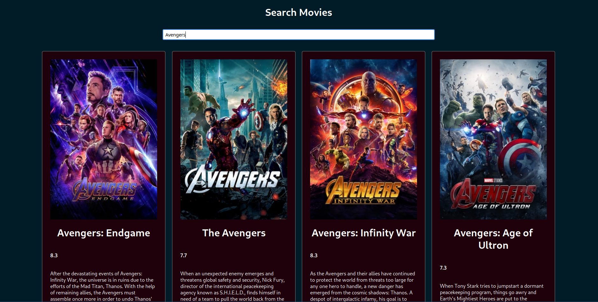

# movie-tracker

A simple movie search app. You can search a movie from TMDB database, it returns the name, image, rating and description of the movie. Upon click to the card, app redirects to IMDB page of the movie.
https://yusufipk.github.io/movie-tracker/

If you want to run it locally, clone the repo and then `npm install`. After that you can run it by typing `npm run`
